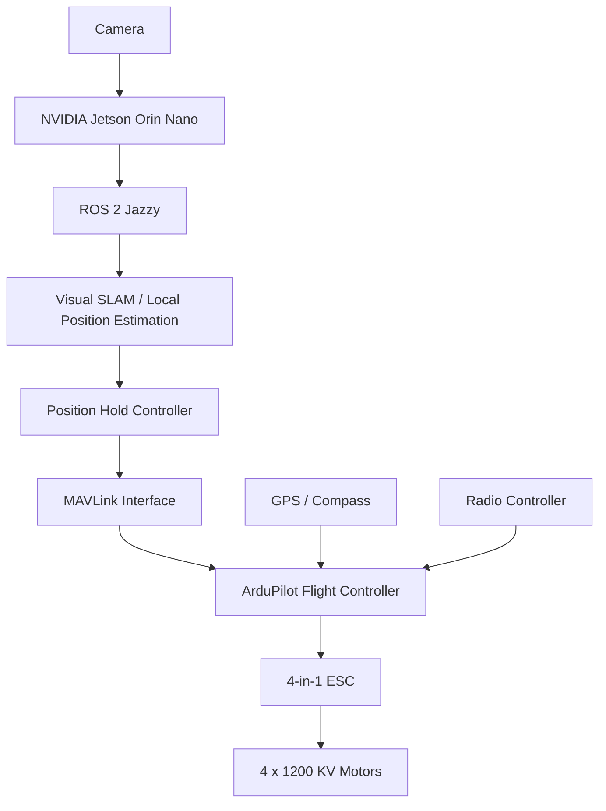
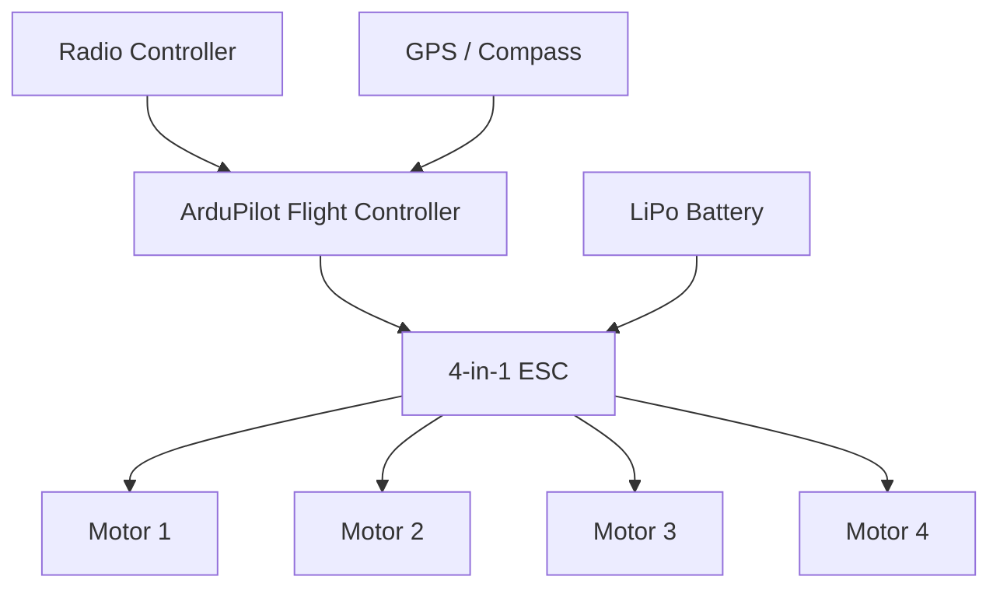

# Autonomous Drone Platform

> **Status: Active Development — hardware flight testing complete; autonomy stack not yet implemented.**

A robotics project focused on developing **GPS-denied position hold and future autonomous navigation** for a quadrotor using **ArduPilot, ROS 2 Jazzy, computer vision, SLAM, and an NVIDIA Jetson Orin Nano**.

The drone currently flies under manual radio control using ArduPilot. The next phase is to add onboard perception and compute so the vehicle can estimate its motion and hold position without relying on GPS.

## Why This Project

Standard GPS-based position hold has been unreliable on the current platform. During testing, the drone drifted significantly while attempting position hold, which can lead to loss of control or crashes. One suspected contributor is interference around the GPS/compass hardware from high-current motor wiring, although this has not yet been confirmed.

Rather than treating GPS as the only localization source, this project is being developed toward a **vision/SLAM-based local positioning system** running on an NVIDIA Jetson companion computer.

## Current State

### Working

- Quadrotor assembled and flight-tested
- ArduPilot running on the flight controller
- Manual flight using a radio transmitter and receiver
- Four 1200 KV motors
- 4-in-1 ESC
- LiPo power system
- GPS hardware installed
- One manual flight video recorded

### Not Yet Implemented

- NVIDIA Jetson Orin Nano integration
- Camera integration
- MAVLink communication with the companion computer
- ROS 2 nodes for the drone
- SLAM
- Visual position estimation
- GPS-denied position hold
- Autonomous path planning

This repository intentionally documents the project from the hardware-flight stage forward instead of presenting unfinished autonomy features as completed work.

## Target System



## Current Hardware Architecture



## Technology

| Area | Technology |
|---|---|
| Flight control | ArduPilot |
| Robotics middleware | ROS 2 Jazzy |
| Companion computer | NVIDIA Jetson Orin Nano *(planned)* |
| Localization | Visual SLAM *(planned)* |
| Flight-computer link | MAVLink *(planned)* |
| Perception | Single onboard camera *(planned)* |
| Motors | 4 × 1200 KV |
| Power | LiPo battery |
| Motor control | 4-in-1 ESC |

## Development Roadmap

- [x] Assemble quadrotor hardware
- [x] Configure ArduPilot
- [x] Achieve stable manual radio-controlled flight
- [x] Test GPS-based position hold
- [ ] Diagnose GPS/compass interference and position-hold drift
- [ ] Mount NVIDIA Jetson Orin Nano
- [ ] Integrate onboard camera
- [ ] Establish MAVLink communication between Jetson and ArduPilot
- [ ] Create ROS 2 Jazzy workspace and drone interface nodes
- [ ] Stream vehicle state into ROS 2
- [ ] Integrate visual SLAM
- [ ] Produce local pose estimate without GPS
- [ ] Feed local-position data into the flight-control stack
- [ ] Implement and test GPS-denied position hold
- [ ] Add autonomous path planning

See [`docs/ROADMAP.md`](docs/ROADMAP.md) for the planned engineering phases.

## Engineering Problem Being Investigated

The immediate technical problem is **localization**.

The current GPS-based position-hold behavior is not reliable enough for autonomous operation. Future work will investigate:

1. GPS/compass placement and electromagnetic interference.
2. Camera-based motion estimation.
3. SLAM-generated local position and orientation.
4. Communication of the local pose to ArduPilot.
5. Closed-loop position-hold performance.

This creates a useful robotics problem spanning **embedded flight control, localization, sensor integration, ROS 2, and autonomous systems**.

## Repository Structure

```text
autonomous-drone-platform/
├── README.md
├── .gitignore
├── LICENSE
├── docs/
│   ├── ARCHITECTURE.md
│   ├── HARDWARE.md
│   └── ROADMAP.md
├── media/
│   └── README.md
└── ros2/
    └── README.md
```

The `ros2/` directory is currently documentation-only. Source packages will be added when development of the Jetson/ROS 2 autonomy stack begins.

## Media

A manual flight-test video has been recorded and will be added to the `media/` section of the project.

## Safety

Autonomous flight software should be validated incrementally in simulation and controlled test environments before unrestricted physical flight. Manual override and ArduPilot failsafes should remain available during testing.

## License

This project is released under the MIT License.
