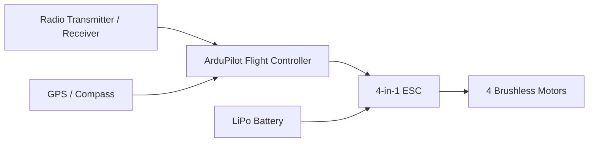
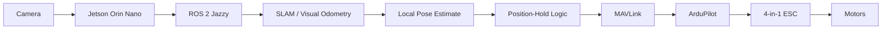

# System Architecture

## Current Architecture

The current system is intentionally simple:

The flight controller currently handles stabilization and manual flight.

## Planned Autonomy Architecture

## Design Goal

The major architectural change is the introduction of an external local-position estimate.

Instead of relying only on GPS for horizontal position, the planned companion-computer stack will estimate the drone's motion from camera data. That estimate can then be used to support GPS-denied position hold.

## Planned Software Responsibilities

### ArduPilot

- low-level attitude stabilization,
- motor output,
- failsafes,
- radio-control input,
- flight modes,
- vehicle state.

### NVIDIA Jetson Orin Nano

- camera processing,
- ROS 2 runtime,
- SLAM / visual odometry,
- local-pose estimation,
- future path planning.

### ROS 2 Jazzy

- sensor and pose message flow,
- modular autonomy nodes,
- debugging and visualization,
- future planning and perception integration.

### MAVLink

MAVLink is planned as the communication layer between the companion computer and ArduPilot. It is **not yet implemented in this project**.
